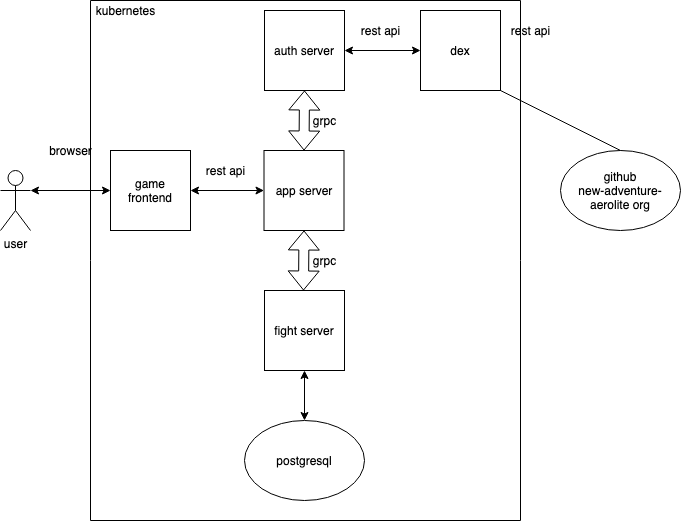

# grpc fight app

fight server is the entry of the postgresql database, also it keeps online sessions in its memory cache, it carries out requests forwarded by app-server, includes create/update/delete the sessions, or create/update/delete records in the db.

## Overview



## Installation

```sh
$ git clone https://github.com/new-adventure-aerolite/grpc-fight-server.git

$ cd grpc-fight-server

$ go mod tidy && go mod vendor

$ go build -o fight-server ./main.go
```

help info:
```sh
$ ./fight-server -h
Usage of ./fight-server:
  -config string
        connection config file to postgresql (default "./config/config.json")
  -port string
        listen port (default "8001")
```

## LICENSE

[MIT](./LICENSE)
